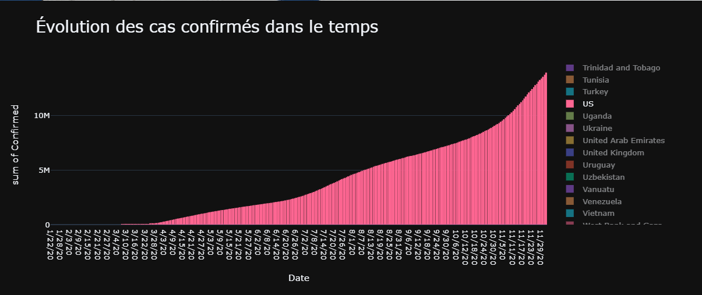
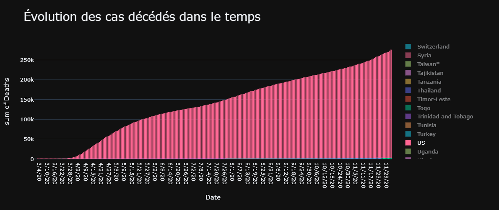
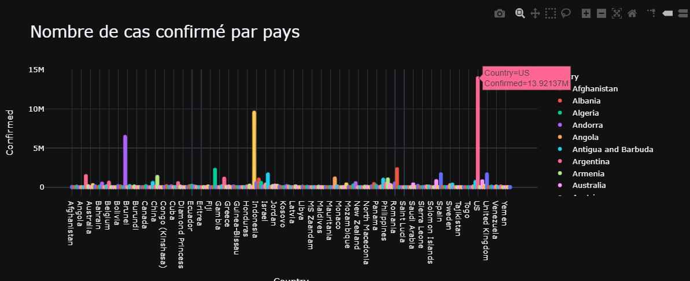
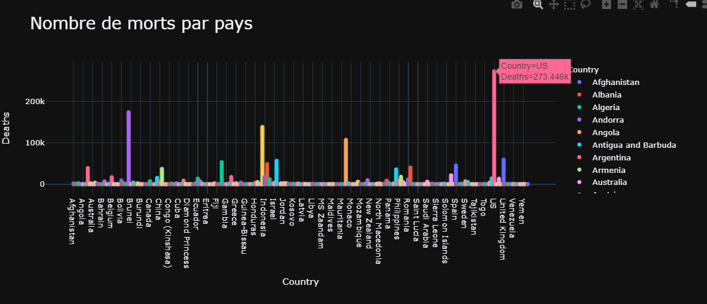

# DashBoard
PROJET DASHBOARD : Mariam AMRAOUI, Bilal CHAHBIA

Rapport d'analyse:
Concernant le sujet choisis, nous avonbs choisis l'étude du COVID-19 dans le monde entre le 22 janvier 2020 et le 29 novembre 2020. 

Nous voulions comparer l'évolution des cas confirmés dans le monde pour chaque pays, et quel était le pays qui a eu la plus grande progression.
Le résultat que nous avons obtenu était que les États-Unis était le pays qui avait la plus rapide ascension dans le nombre de cas confirmés comparé aux autres pays.
En effet si on ne sélectionne que les États-Unis dans le graphiques on obtiens ce résultat:

Les États-Unis ont également le plus de cas confirmé et les cas décédés dans le monde.

On a aussi vu qu'en fin d'année 2020, sur tout les cas qu'il y a eu dans le monde, il y en as eu 31% qui sont morts, soit 1 personne sur 3 qui est morte.

USER GUIDE :
	Pour lancer le programme, on lance le fichier Data_01.py, qui va ouvrir le dashborad dans une page HTML  à l'URL http://127.0.0.1:8050/
	Néanmois, pour lancer le programme, certains package sont nécéssaires:
	Dash : pip install dash
	Plotly-express : pip install plotly-express
	Plotly : pip install plotly
	Panda : pip install pandas
	Ensuite pour lancer le programme sur l'invite de commande c'est 

DEVELOPPER GUIDE :
	Au niveau du code, il y a deux parties distinctes, une partie où on déclare des nouvelles figures pour le dashboard,
	et une autre où l'on crée le dashboard et on y rajoute les figures.
	Pour rajouter des éléments au dashboard il de déclarer de nouvelles figures dans la première parties du code, et de les 
	rajouter par la suite dans la partie de la déclaration du dashboard.
	

