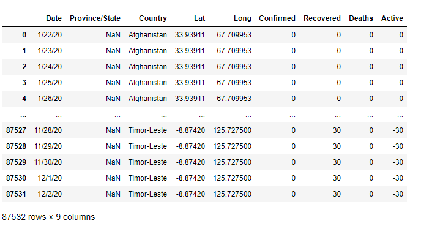
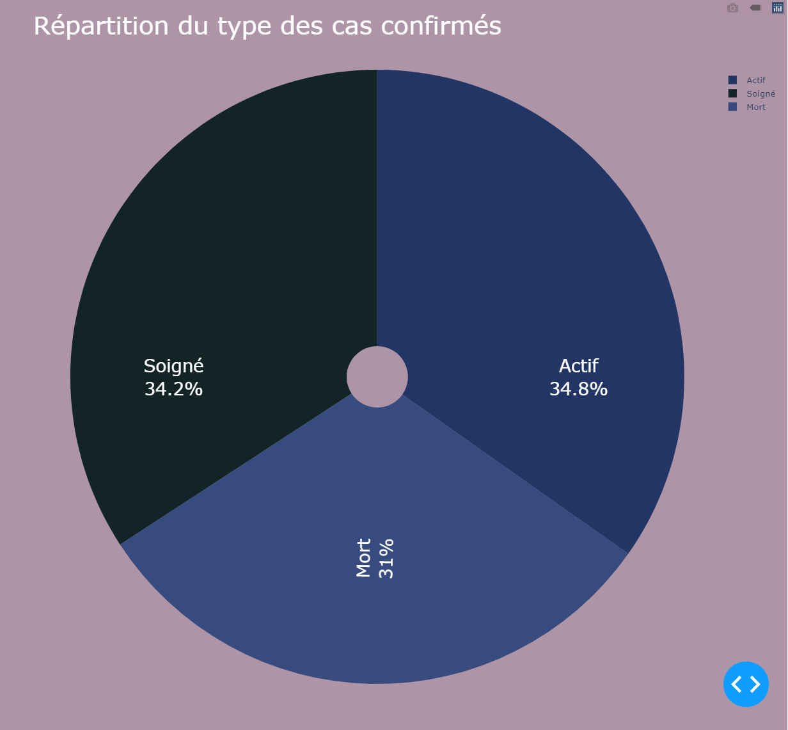
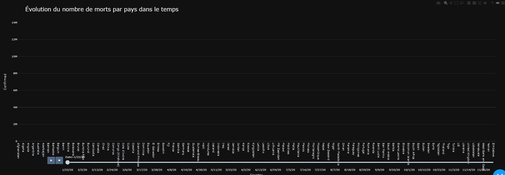

# DashBoard
PROJET DASHBOARD : Mariam AMRAOUI, Bilal CHAHBIA

Rapport d'analyse:

Concernant le sujet choisi, nous avons choisi l'étude du COVID-19 dans le monde entre le 22 janvier 2020 et le 2 décembre 2020. 
Les données ont été receuillies sur Kaggle.com, une plateforme web organisant des compétitions en science des données, une aubaine pour ce projet qui nécessite un jeu de données.
Voici le lien des données que nous avons choisi : https://www.kaggle.com/junyingsg/covid19-dataset, il y a plusieurs jeux de données et nous avons choisi le 
"covid_19_data_cleaned.csv". Concernant les données utilisées, nous n'avons réalisé aucun traitement ni modification sur ces dernières.
Elles sont organisées en 9 catégories "Date,Province/State,Country,Lat,Long,Confirmed,Recovered,Deaths,Active" :

Nous avons une représentation géographique de la répartition des cas confirmés mais également des cas décédés dans le monde:

Nous voulions comparer l'évolution des cas confirmés dans le monde pour chaque pays, et quel était le pays qui a eu la plus grande progression.
Le résultat que nous avons obtenu, était que les États-Unis était le pays qui avait la plus rapide ascension dans le nombre de cas confirmés comparé aux autres pays.
En effet, si on ne sélectionne que les États-Unis dans le graphique on obtient le résultat suivant:

Les États-Unis ont également le plus de cas confirmés et les cas décédés dans le monde.

On a aussi vu qu'en fin d'année 2020, sur tous les cas qu'il y a eu dans le monde, il y a eu 31% de morts, soit 1 personne sur 3 qui est morte:

Pour avoir une vision de l'évolution globale dans le temps, il y a un graphique animé qui permet de voir petit à petit l'évolution des cas confirmés, il faut appuyer sur le bouton play pour l'activer :

Les differents graphiques présentés dans le dashboard sont tous bien évidemment intéractifs.

USER GUIDE :

Pour lancer le programme, on lance le fichier Data_01.py, qui va ouvrir le dashboard dans une page HTML à l'URL http://127.0.0.1:8050/
Néanmoins, pour lancer le programme, certains packages sont nécéssaires:
Dash : pip install dash
Plotly-express : pip install plotly-express
Plotly : pip install plotly
Panda : pip install pandas
Ensuite pour lancer le programme, il faut aller sur l'invite de commande, au chemin du programme Data_01.py et ensuite écrire tout simplement "Data_01.py".

DEVELOPPER GUIDE :

Au niveau du code, il y a deux parties distinctes, une partie où on déclare des nouvelles figures pour le dashboard, et une autre où l'on crée le dashboard et où on y rajoute les figures.
Pour rajouter des éléments au dashboard il suffit de déclarer de nouvelles figures dans la première partie du code, et de les 
rajouter par la suite dans la partie de la déclaration du dashboard.
